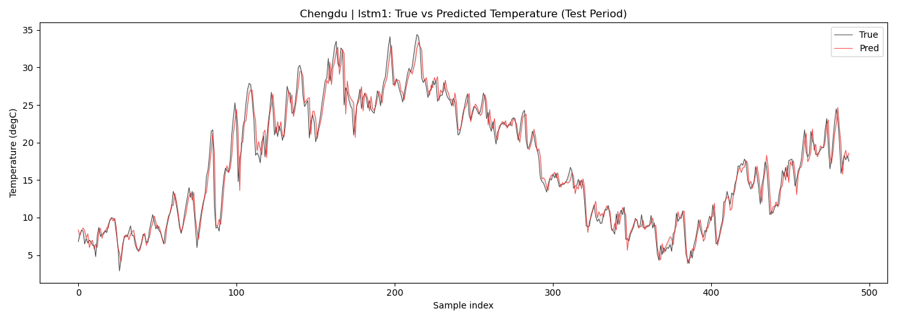
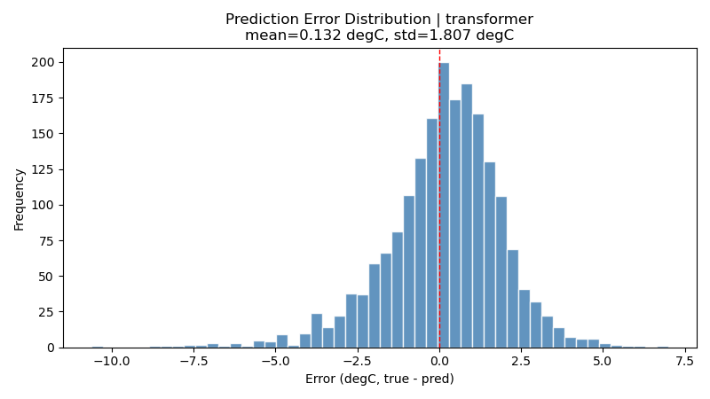

# 🛰️ Weather Forcast — Deep Learning Weather Prediction for Southwest China

[](https://python.org)
[](https://pytorch.org)
[](https://streamlit.io)
[](LICENSE)

A deep learning weather prediction system for Southwest China (Yunnan, Guizhou, Sichuan, Chongqing). Uses LSTM and Transformer models trained on real ERA5 reanalysis data from Open-Meteo API to predict daily average temperature across 4 representative cities.

**Training data**: 2010 → today (auto-updates daily)

<p align="center">
  
  
</p>

---

## Features

- **Real Data**: Fetches live ERA5 data via Open-Meteo API (free, no API key)
- **3 Model Architectures**: Single-Layer LSTM · Double-Layer LSTM + Dropout · Transformer Encoder
- **Multi-Step Forecast**: Predict 1/7/30 days ahead with confidence bands
- **Sci-Fi Dashboard**: Glassmorphism dark UI with interactive Plotly charts
- **Incremental Updates**: Only fetches new data since last run
- **One-Click Launch**: `run.bat` handles everything

## Quick Start

### Prerequisites

- [Anaconda](https://www.anaconda.com/) or [Miniconda](https://docs.conda.io/en/latest/miniconda.html)
- Windows / macOS / Linux

### Setup (first time only)

```bash
# Clone the repo
git clone git@github.com:lucky-money-account/Weather-Forcast.git
cd Weather-Forcast

# Run setup (creates conda env + installs all dependencies)
setup.bat        # Windows
# bash setup.sh  # macOS/Linux (not yet provided)
```

### Launch

```
run.bat          # Windows: double-click or run in terminal
```

Opens `http://localhost:8501` in your browser.

## Project Structure

```
Weather-Forcast/
├── config.yaml              # All tunable hyperparameters
├── run.bat                  # One-click launch
├── setup.bat                # One-time environment setup
├── README.md
├── .gitignore
├── src/
│   ├── app.py               # Sci-Fi Streamlit dashboard
│   ├── data_prep.py         # Real data fetching + preprocessing
│   ├── dataset.py           # PyTorch Dataset class
│   ├── models.py            # LSTM1 / LSTM2 / Transformer models
│   ├── train.py             # Training entry point
│   └── evaluate.py          # Evaluation + metrics + plots
├── data/                    # Cached data + npz + scalers
├── checkpoints/             # Trained model .pt files
├── runs/                    # TensorBoard logs
└── plots/                   # Generated evaluation charts
```

## Usage

### CLI Mode

```bash
conda activate sw_weather

# Fetch real data (auto to today)
python src/data_prep.py

# Train models
python src/train.py                    # uses config.yaml defaults
python src/train.py --model lstm2      # switch architecture
python src/train.py --epochs 30        # more epochs

# Evaluate
python src/evaluate.py --all           # compare all trained models

# TensorBoard
tensorboard --logdir runs/
```

### Dashboard Tabs

| Tab | Description |
|-----|-------------|
| **Historical + Forecast** | Temperature history with AI forecast overlay, model metrics, error histogram |
| **Forecast Panel** | Multi-step prediction (1/7/30 days) with daily table + confidence band chart |
| **Cross-City Comparison** | 90-day moving average temperature for all 4 cities |

## Model Performance (15 epochs, real data 2010-2026)

| Model | Params | MAE (°C) | RMSE (°C) | R² |
|-------|--------|----------|-----------|-----|
| LSTM v1 | 5,281 | 1.06 | 1.53 | 0.950 |
| LSTM v2 | 14,849 | 1.07 | 1.52 | 0.951 |
| Transformer | 29,825 | 1.35 | 1.81 | 0.935 |

> LSTM v2 achieves the best R² score. All models predict next-day temperature within ~1°C error on unseen test data (2025-2026).

## Data Source

| Dataset | Source | Coverage |
|---------|--------|----------|
| Temperature, Humidity, Wind, Pressure | [Open-Meteo Archive API](https://open-meteo.com/) | 2010 → today |
| Precipitation, Min/Max Temperature | ERA5 reanalysis (via Open-Meteo) | Hourly, aggregated daily |

## Configuration

All tunable parameters in `config.yaml`:

```yaml
model:
  name: lstm2          # lstm1 | lstm2 | transformer
  hidden_dim: 32       # 32-fast, 64-accurate
  dropout: 0.1

train:
  loss: mae
  epochs: 20
  batch_size: 64
  patience: 6          # early stopping
```

## License

MIT
